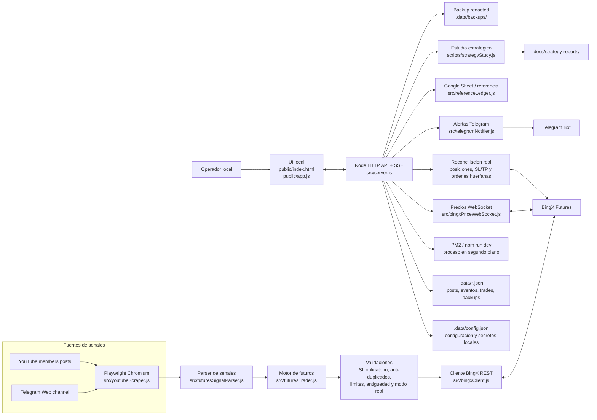

# Futures Magician

Futures Magician es una aplicacion local para monitorizar publicaciones de miembros de YouTube, leer mensajes de Telegram Web, emitir alertas por Telegram y gestionar senales de futuros en BingX con varios modos de seguridad.

La aplicacion esta pensada para ejecutarse en tu propia maquina. Las sesiones web viven en un perfil Chromium persistente y los secretos se guardan en `.data/config.json`, que esta ignorado por Git.

## Indice

- [Que hace](#que-hace)
- [Arquitectura](#arquitectura)
- [Modos de BingX](#modos-de-bingx)
- [Requisitos](#requisitos)
- [Instalacion rapida](#instalacion-rapida)
- [Arranque con PM2](#arranque-con-pm2)
- [Configuracion inicial](#configuracion-inicial)
- [Operacion diaria](#operacion-diaria)
- [Seguridad y limites](#seguridad-y-limites)
- [Paneles de la UI](#paneles-de-la-ui)
- [Informes, backups y auditoria](#informes-backups-y-auditoria)
- [Endpoints utiles](#endpoints-utiles)
- [Estructura del proyecto](#estructura-del-proyecto)
- [Datos locales](#datos-locales)
- [Troubleshooting](#troubleshooting)
- [Documentacion ampliada](#documentacion-ampliada)

## Que hace

- Scrapea posts de miembros de YouTube con Playwright.
- Puede leer un canal de Telegram Web para detectar mensajes de gestion antes de que aparezcan en YouTube.
- Detecta senales de futuros: aperturas, cierres, cierre total, take profits, modificaciones de stop loss y stop a break even.
- Permite alertas por Telegram para posts, eventos criticos y salud del monitor.
- Opera contra BingX en `test`, Demo VST, live real o modo mixto, segun configuracion.
- Requiere stop loss si se activa esa proteccion.
- Mantiene anti-duplicados para evitar repetir senales ya procesadas.
- Reconcilia lo que la app cree que existe con lo que BingX devuelve.
- Muestra PnL real, Google Sheet de referencia, ROI mensual, historial auditable, linea de vida de senales e incidencias.
- Genera informes de estudio estrategico para aprender patrones de la operativa.
- Genera backups redacted sin credenciales.

## Arquitectura



Flujo principal:

1. La UI configura fuentes, Telegram, BingX, limites y modo de ejecucion a traves de la API local.
2. Playwright mantiene sesiones persistentes en `.yt-profile/` y lee YouTube/Telegram Web.
3. El parser convierte texto libre en eventos operables: apertura, cierre, TP, SL, break even o cierre total.
4. El motor de futuros valida cada senal antes de enviarla: stop loss, duplicados, limites, antiguedad, modo y bloqueo local.
5. BingX ejecuta o reconcilia segun el modo activo; la app compara periodicamente estado local contra estado real.
6. Telegram Bot avisa de senales, ejecuciones, errores, descuadres, salud del monitor y acciones criticas.
7. Los stores locales, backups redacted e informes permiten auditar lo ocurrido sin subir secretos al repo.

## Modos de BingX

| Modo | Descripcion | Uso recomendado |
|---|---|---|
| `test` | Simulacion local/paper. No envia ordenes reales. | Primeras pruebas y validacion de parser. |
| `demo` | Opera en BingX Demo VST. | Ensayo con entorno exchange sin dinero real. |
| `live` | Opera en cuenta real USDT. | Solo con API validada, live confirmado y riesgo revisado. |
| `dual` | Ejecuta Demo VST y live real en paralelo. | Comparar ejecucion demo/real. |

La pestana de futuros reales muestra solo USDT y estado de la cuenta real.

## Requisitos

- Node.js 20 o superior.
- npm.
- Playwright Chromium.
- Cuenta de YouTube con acceso al canal que se quiera monitorizar.
- Opcional: bot de Telegram para alertas.
- Opcional: API key y secret de BingX.
- Opcional: PM2 para dejar la app en segundo plano.

## Instalacion rapida

```bash
git clone https://github.com/JotaTerrasa/yt-members-signal-trader.git
cd yt-members-signal-trader
npm install
npm run install:browsers
npm run dev
```

Abre la app:

```text
http://localhost:5178
```

Comprueba salud:

```bash
curl http://localhost:5178/api/health
```

Respuesta esperada:

```json
{
  "ok": true,
  "health": {
    "level": "ok"
  }
}
```

## Arranque con PM2

Instala PM2 si no lo tienes:

```bash
npm install -g pm2
```

Arranca la app:

```bash
pm2 start npm --name yt-members-signal-trader -- run dev
pm2 save
pm2 status yt-members-signal-trader
```

Ver logs:

```bash
pm2 logs yt-members-signal-trader
```

Reiniciar:

```bash
pm2 restart yt-members-signal-trader --update-env
```

El monitor puede auto-resumir tras reinicio si se guardo con `autoResume` activo desde la UI.

## Configuracion inicial

### 1. YouTube

1. Pega la URL de la pestana de publicaciones.
2. Pulsa `Abrir sesion`.
3. Inicia sesion en Chromium.
4. Activa `Monitor continuo`.
5. Usa un intervalo razonable, por ejemplo `30 s`.
6. Pulsa `Iniciar`.

### 2. Telegram Web como fuente

1. Activa `Scrapear canal`.
2. Pega la URL de Telegram Web.
3. Pulsa `Abrir canal`.
4. Inicia sesion si Chromium lo pide.
5. Deja activo `Cierres/TP/SL` si quieres usar Telegram para gestion.
6. Mantener `Permitir aperturas` desactivado es lo mas conservador.
7. Si el modo BingX es live, marca la confirmacion explicita.

### 3. Telegram bot para alertas

1. Crea un bot con BotFather.
2. Pega el token en `Bot token`.
3. Detecta o introduce el `Chat ID`.
4. Pulsa `Probar`.
5. Activa alertas de salud.

No escribas tokens en README, issues, commits ni capturas.

### 4. BingX

1. Activa `Auto-operar senales` solo cuando estes listo.
2. Elige modo: `test`, `demo`, `live` o `dual`.
3. Pega API key y API secret.
4. Configura tamano por orden, margen, apalancamiento maximo y limites.
5. Activa `Exigir stop loss`.
6. Si vas a live, revisa el checklist `Preparado para live`.
7. Arma live solo desde la UI y con confirmacion consciente.

## Operacion diaria

Antes de dejar la app funcionando:

- `/api/health` debe devolver `ok`.
- PM2 debe estar `online`.
- En la UI, `Monitor live activo` debe estar verde.
- `API BingX validada` debe estar verde si usas BingX.
- `Stop loss obligatorio` debe estar verde.
- `Seguro real BingX` debe indicar que no faltan SL/TP criticos.
- `Watchdog Telegram Web` debe indicar lectura reciente si Telegram es fuente de gestion.
- `Guardia nocturna` debe estar estable.
- `Incidencias 24h` no debe mostrar errores criticos sin revisar.
- `Backup auto` debe tener una ejecucion reciente o programada.

Durante la sesion:

- Revisa `Linea de vida real` para ver cada senal: recibida, parseada, validada, enviada, aceptada y cerrada.
- Revisa `Historial de senales` para auditar la senal original, orden enviada, respuesta de BingX, PnL y motivo.
- Revisa `Rendimiento` para comparar futuros reales y Google Sheet.
- Revisa `Estudio estrategico` para conclusiones estadisticas, no para ejecutar decisiones autonomas todavia.

## Seguridad y limites

La app puede enviar ordenes reales si la config lo permite. Trata el panel local como una consola de produccion.

Reglas recomendadas:

- No actives live sin haber probado en `test` y `demo`.
- No des permisos de retirada a las API keys.
- Usa IP whitelist si BingX lo permite.
- Mantener stop loss obligatorio.
- Configurar limite de perdida diaria.
- Configurar limite de perdida mensual.
- Configurar maximo de ordenes por dia.
- No expongas `localhost:5178` a internet sin autenticacion.
- No subas `.data/config.json`.
- No borres `.yt-profile/` si quieres conservar sesiones de YouTube/Telegram Web.

Botones de emergencia disponibles:

- `Pausar entradas`.
- `Solo gestion`.
- `Cancelar pendientes`.
- `Cerrar todo real`.

Los botones destructivos piden confirmacion textual.

## Paneles de la UI

### Posts

Muestra posts guardados, mensajes detectados, enlaces y texto scrapeado.

### Eventos

Muestra logs internos: scraping, Telegram, BingX, health, backups e incidencias.

### PnL

Incluye:

- Futuros reales en USDT.
- Google Sheet de referencia.
- ROI mensual.
- Simulador de capital inicial para Google Sheet.
- Guardia nocturna.
- Incidencias 24h.
- Preparado para live.
- Salud del monitor.
- Watchdog Telegram Web.
- Riesgo operativo local.
- Seguro real BingX.
- Emergencia real.
- Posiciones abiertas.
- Estudio estrategico.
- Linea de vida real.
- Historial auditable.
- Rendimiento detallado.

## Informes, backups y auditoria

### Estudio estrategico

Ejecutar manualmente:

```bash
npm run study:strategy
```

Genera:

```text
.data/strategy-study/strategy-study.json
.data/strategy-study/strategy-report.md
docs/strategy-reports/latest.md
docs/strategy-reports/strategy-study-*.md
```

La UI lee el ultimo informe desde:

```text
/api/strategy-study/latest
```

### Backup redacted

Endpoint manual:

```text
/api/backup/redacted
```

Backups automaticos:

```text
.data/backups/latest-redacted.json
.data/backups/futures-magician-backup-YYYY-MM-DD.json
```

El backup redacted omite:

- API keys.
- API secrets.
- Bot token.
- Chat ID.
- Previews de secretos.

### Auditoria

Endpoints:

```text
/api/audit
/api/trade-events
/api/trades.csv
/api/export.json
/api/export.csv
```

## Endpoints utiles

| Endpoint | Descripcion |
|---|---|
| `GET /api/health` | Salud del monitor. |
| `GET /api/state` | Estado completo de app y monitor. |
| `GET /api/audit` | Snapshot auditable. |
| `GET /api/operational-status` | Guardia, incidencias, backup y cooldown PnL. |
| `GET /api/bingx/positions` | Reconciliacion de posiciones. |
| `GET /api/bingx/pnl-sources` | Fuentes de rendimiento. |
| `GET /api/historical-pnl` | Historico local/Google Sheet. |
| `GET /api/strategy-study/latest` | Ultimo estudio estrategico. |
| `GET /api/backup/redacted` | Backup seguro descargable. |

## Estructura del proyecto

```text
public/
  index.html             UI local
  app.js                 Estado frontend, paneles, PnL, auditoria
  styles.css             Estilos

src/
  server.js              API HTTP, SSE, salud, PM2 runtime
  youtubeScraper.js      Playwright, YouTube y Telegram Web
  futuresSignalParser.js Parser de senales
  futuresTrader.js       Test/demo/live/dual y gestion
  bingxClient.js         Cliente REST BingX
  bingxPriceWebSocket.js WebSocket de precios
  referenceLedger.js     Google Sheet de referencia
  portfolioDetector.js   Deteccion de portfolio
  *Store.js              Persistencia local

scripts/
  strategyStudy.js       Informe estrategico

docs/
  ARCHITECTURE.md
  DEPLOYMENT.md
  OPERATIONS.md
  SECURITY.md
  SIGNALS.md
  STRATEGY_STUDY.md
  strategy-reports/
```

## Datos locales

Ignorados por Git:

```text
.data/
.yt-profile/
node_modules/
tmp/
.env
.env.*
```

Contenido importante:

```text
.data/config.json             Configuracion local con secretos
.data/posts.json              Posts/mensajes guardados
.data/trade-events.json       Eventos de trading
.data/paper-trades.json       Simulacion local
.data/backups/                Backups redacted
.yt-profile/                  Sesiones Chromium
```

No borres `.yt-profile/` salvo que quieras reiniciar sesiones web.

## Troubleshooting

### La app no abre

```bash
pm2 status yt-members-signal-trader
pm2 logs yt-members-signal-trader
```

Si no usas PM2:

```bash
npm run dev
```

### `/api/health` no devuelve `ok`

Revisa:

- Si Chromium esta logueado.
- Si YouTube devuelve posts visibles.
- Si el monitor esta activo.
- Si el puerto `5178` esta libre.

### Telegram Web no lee mensajes

Revisa el panel `Watchdog Telegram Web`.

Acciones:

1. Pulsa `Abrir canal`.
2. Comprueba si Telegram pide login.
3. Espera el refresh configurado o reinicia monitor.
4. Mira `Incidencias 24h`.

### BingX PnL muestra rate-limit

Es normal si se consulta demasiado el historico. La app entra en cooldown y usa ultimo dato/fallback hasta que BingX permita reintentar.

Revisa:

```text
Guardia nocturna -> PnL historico
Watchdog Telegram Web -> PnL BingX
```

### Hay posiciones sin SL/TP confirmado

Revisa:

- `Seguro real BingX`.
- `Linea de vida real`.
- `Historial de senales`.
- La cuenta de BingX directamente.

### El monitor se para tras reinicio

Comprueba que auto-resume este guardado y PM2 online:

```bash
pm2 status yt-members-signal-trader
curl http://localhost:5178/api/health
```

## Documentacion ampliada

- [Despliegue](docs/DEPLOYMENT.md)
- [Operacion diaria](docs/OPERATIONS.md)
- [Formato de senales](docs/SIGNALS.md)
- [Arquitectura](docs/ARCHITECTURE.md)
- [Seguridad](docs/SECURITY.md)
- [Estudio estrategico](docs/STRATEGY_STUDY.md)

## Aviso

Este proyecto automatiza acciones de trading a partir de texto scrapeado. El parser y la ejecucion pueden fallar si cambia el formato de las senales, si el exchange responde distinto, si hay latencia, rate-limit, sesion web caducada o errores humanos de configuracion.

Antes de usar live real, valida en test/demo, revisa la auditoria y usa limites de riesgo.
