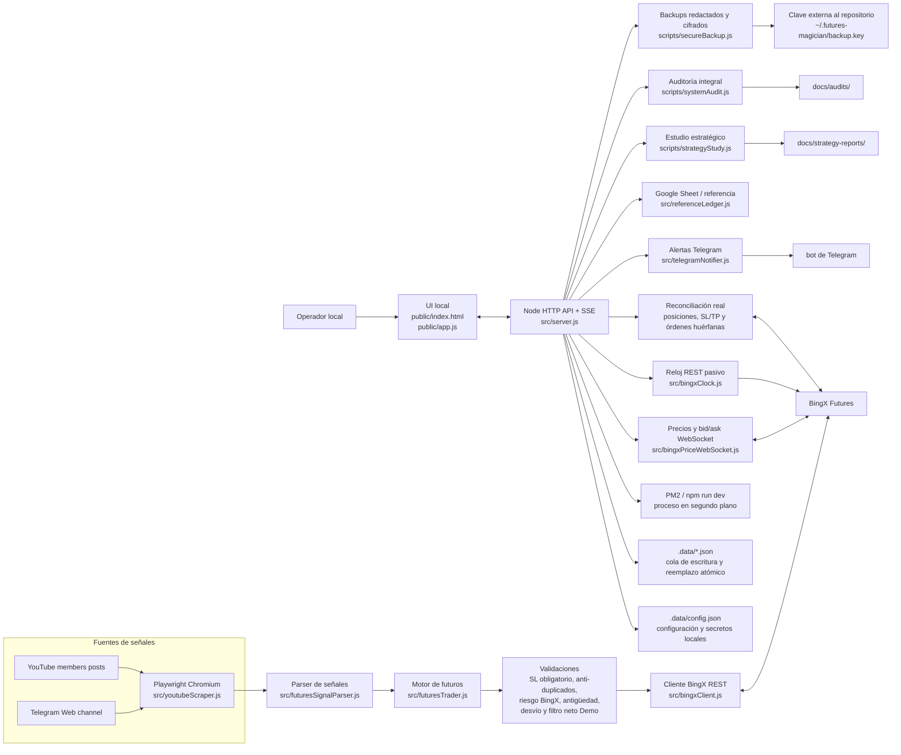

# Futures Magician

Futures Magician es una aplicación local para monitorizar publicaciones de miembros de YouTube, leer mensajes de Telegram Web, emitir alertas por Telegram y gestionar señales de futuros en BingX con varios modos de seguridad.

La aplicación está pensada para ejecutarse en tu propia máquina. Las sesiones web viven en un perfil Chromium persistente y los secretos se guardan en `.data/config.json`, que está ignorado por Git.

## Índice

- [Qué hace](#qué-hace)
- [Arquitectura](#arquitectura)
- [Modos de BingX](#modos-de-bingx)
- [Requisitos](#requisitos)
- [Instalación rápida](#instalación-rápida)
- [Paquetización portable](#paquetización-portable)
- [Arranque con PM2](#arranque-con-pm2)
- [Configuración inicial](#configuración-inicial)
- [Operación diaria](#operación-diaria)
- [Seguridad y límites](#seguridad-y-límites)
- [Paneles de la UI](#paneles-de-la-ui)
- [Informes, backups y auditoría](#informes-backups-y-auditoría)
- [Endpoints útiles](#endpoints-útiles)
- [Estructura del proyecto](#estructura-del-proyecto)
- [Datos locales](#datos-locales)
- [Guía para Codex](#guía-para-codex)
- [Troubleshooting](#troubleshooting)
- [Documentación ampliada](#documentación-ampliada)

## Qué hace

- Rastrea posts de miembros de YouTube con Playwright.
- Puede leer un canal de Telegram Web para detectar mensajes de gestión antes de que aparezcan en YouTube.
- Detecta señales de futuros: aperturas, cierres, cierre total, take profits, modificaciones de stop loss y stop a break even.
- Permite alertas por Telegram para posts, eventos críticos y salud del monitor.
- Opera contra BingX en `test`, Demo VST, live real o modo mixto, según configuración.
- Requiere stop loss si se activa esa protección.
- Mantiene anti-duplicados para evitar repetir señales ya procesadas.
- Reconcilia lo que la app cree que existe con lo que BingX devuelve.
- Muestra PnL real, hoja de Google de referencia, ROI mensual, historial auditable, línea de vida de señales e incidencias.
- Destaca la equity frente al capital inicial y audita la desviación entre precios publicados y ejecutados.
- Ejecuta los cierres explícitos inmediatamente a mercado; el slippage se registra como advertencia y nunca retiene la salida.
- Reintenta durante tres minutos los cierres que fallen por un error transitorio de red o de BingX, conservando el modo demo/live y la protección anti-duplicados.
- Reintenta aperturas bloqueadas por una zona temporalmente inválida o por fallos transitorios, sin perseguir precios desfavorables.
- En Demo VST recupera correcciones recientes de una publicación editada cuando cambian la entrada, el stop o el apalancamiento. La antigüedad máxima y el antiduplicados siguen siendo obligatorios; una edición de prosa o TP no reabre posiciones y Live real queda fuera.
- Asigna a cada apertura un identificador determinista: un timeout o un reinicio no puede convertir un reintento en una segunda posición.
- Conserva en `.data/execution-retries.json` las aperturas y los cierres pendientes para recuperarlos después de reiniciar el proceso.
- Conserva en `.data/pnl-snapshots.json` la última lectura histórica válida de BingX. Un reinicio, rate limit o `system busy` ya no sustituye temporalmente fees, cierres y PnL por ceros.
- Mantiene en Demo VST una reserva técnica de margen antes de cada paquete y descuenta esas aportaciones de la equity estratégica y del ROI.
- Evalúa en Demo VST un filtro neto de entrada que marca operaciones con coste/riesgo, break-even o R/R desfavorables. Por defecto opera en sombra; solo bloquea si se cambia explícitamente a modo bloqueo.
- Empareja las entradas marcadas en sombra con sus cierres y muestra su PnL neto estimado. También avisa cuando un umbral marcaría por construcción todas las señales con el apalancamiento observado.
- Rechaza aperturas antiguas, entradas perseguidas y stops anormalmente lejanos.
- Autorrecupera la pestaña de YouTube tras tres lecturas vacías consecutivas y agrupa los avisos repetidos para evitar ruido en Telegram.
- Limita el trabajo visual de Posts, Eventos y las tablas extensas de Rendimiento mediante paginación progresiva. Los totales y diagnósticos siguen usando la muestra completa, mientras el canal SSE se mantiene compacto durante el monitor continuo.
- Supervisa el canal SSE con heartbeat cada 15 segundos. Si el panel queda 45 segundos sin actividad, muestra la reconexión y crea un canal nuevo con espera exponencial, sin detener el monitor del backend.
- Descarta de forma aislada cualquier evento SSE truncado o con JSON inválido. La interfaz avisa, conserva la conexión y se recupera con el siguiente evento válido o heartbeat; la operativa del backend no se interrumpe.
- Identifica cada arranque del backend. Si una pestaña sigue abierta durante un reinicio o despliegue, detecta la nueva instancia y recarga una sola vez el frontend para no conservar una interfaz antigua.
- Comprueba una vez por minuto la versión de HTML, JavaScript y estilos. Si cambian sin reiniciar el backend, muestra un aviso para actualizar la interfaz en un clic; el monitor y las órdenes continúan en el servidor mientras se recarga la página.
- Separa en `Incidencias 24h` los problemas activos, los ya recuperados y los registros informativos. Una alerta histórica no mantiene el panel en aviso si la fuente correspondiente vuelve a estar sana.
- Arranca el canal en tiempo real antes que las consultas auxiliares. Si una fuente inicial devuelve un error temporal o no responde en 8 segundos, el navegador cancela esa lectura, el resto del panel permanece operativo y solo esa fuente se reintenta a los 2, 5, 15 y 30 segundos.
- Carga Google Sheet, auditoría de réplica, fuentes VST/real y PnL de cuenta de forma independiente, con 30 segundos máximos por lectura. Una caída de la hoja no bloquea las cifras de BingX y una caída de BingX no elimina la última copia válida de la hoja.
- El botón `Actualizar` de Rendimiento omite las cachés de lectura de Google Sheet, auditoría y PnL para solicitar el dato más reciente. Mantiene el cooldown protector de BingX y agrupa las lecturas simultáneas de la misma hoja para no duplicar peticiones.
- La auditoría diaria solicita una réplica fresca y aplica la misma gracia de 15 minutos que las alertas de Telegram antes de registrar como degradación una ausencia temporal de publicaciones visibles.
- Agrupa las ráfagas de precios de BingX y actualiza primero posiciones, riesgo y totales. Gráficos, histórico y auditoría se sincronizan después sin reconstruirse con cada tick.
- Sirve Lucide desde la propia aplicación y carga Plotly localmente solo al abrir Rendimiento. Posts y Eventos arrancan sin la librería de gráficos y los CDN quedan como respaldo, no como dependencia del funcionamiento normal.
- Negocia Brotli o gzip para HTML, CSS, JavaScript, JSON y SVG, y usa `ETag` para responder `304` cuando el archivo no ha cambiado. Esto reduce especialmente la carga de Rendimiento mediante móvil o túnel.
- Guarda los JSON locales mediante escrituras en cola y reemplazo atómico para no dejar archivos parciales ante reinicios.
- Genera informes de estudio estratégico para aprender patrones de la operativa.
- Genera backups redactados para soporte y backups cifrados restaurables de los datos locales.

## Arquitectura



Flujo principal:

1. La UI configura fuentes, Telegram, BingX, límites y modo de ejecución a través de la API local.
2. Playwright mantiene sesiones persistentes en `.yt-profile/` y lee YouTube/Telegram Web.
3. El parser convierte texto libre en eventos operables: apertura, cierre, TP, SL, break even o cierre total.
4. El motor de futuros procesa las señales en una cola única y valida stop loss, distancia del stop, duplicados, riesgo de la cuenta, antigüedad, desvío adverso, filtro neto Demo y modo.
5. BingX ejecuta o reconcilia según el modo activo; la app compara periódicamente estado local contra estado real.
6. El bot de Telegram avisa de señales, ejecuciones, errores, descuadres, salud del monitor y acciones críticas.
7. Los almacenes locales, backups redactados e informes permiten auditar lo ocurrido sin subir secretos al repo.

## Modos de BingX

| Modo | Descripción | Uso recomendado |
|---|---|---|
| `test` | Simulación local/paper. No envía órdenes reales. | Primeras pruebas y validación de parser. |
| `demo` | Opera en BingX Demo VST. | Ensayo con entorno exchange sin dinero real. |
| `live` | Opera en cuenta real USDT. | Solo con API validada, live confirmado y riesgo revisado. |
| `dual` | Ejecuta Demo VST y live real en paralelo. | Comparar ejecución demo/real. |

La pestaña de futuros reales muestra solo USDT y estado de la cuenta real.

## Requisitos

- Node.js 20 o superior.
- npm.
- Playwright Chromium.
- Cuenta de YouTube con acceso al canal que se quiera monitorizar.
- Opcional: bot de Telegram para alertas.
- Opcional: API key y secret de BingX.
- Opcional: PM2 para dejar la app en segundo plano.

## Instalación rápida

```bash
git clone https://github.com/JotaTerrasa/yt-members-signal-trader.git
cd yt-members-signal-trader
npm install
npm run install:browsers
npm run dev
```

Abre la app:

```text
http://localhost:5178
```

Comprueba salud:

```bash
curl http://localhost:5178/api/health
```

Respuesta esperada:

```json
{
  "ok": true,
  "health": {
    "level": "ok"
  }
}
```

## Paquetización portable

El repositorio incluye tres formas de dejar la app funcionando:

| Modo | Comando | Cuándo usarlo |
|---|---|---|
| Local | `npm run start` | Desarrollo, uso en escritorio e inicio de sesión visual en Chromium. |
| PM2 | `pm2 start ecosystem.config.cjs` | Mantenerla viva en la misma máquina tras reinicios. |
| Docker | `npm run docker:up` | Ejecutarla de forma reproducible en servidores o mini-PC. |

Comprobación portable:

```bash
npm run package:check
```

Cada push a `main` y cada pull request ejecutan además la validación automática de GitHub Actions:

- instalación reproducible con `npm ci`;
- comprobación de sintaxis y suite completa en Node.js 20 y 24;
- construcción de la imagen Docker;
- arranque aislado y comprobación real de `/api/health`;
- recreación del contenedor y persistencia de datos, perfil e informes.

Docker:

```bash
cp .env.example .env
npm run docker:up
```

Después de construir una imagen también puedes ejecutar el smoke test portable sin usar datos reales:

```bash
npm run docker:check -- --image futures-magician:local
```

Docker publica el puerto únicamente en `127.0.0.1` de forma predeterminada. Para proteger un acceso mediante Cloudflare Tunnel, define `APP_BASIC_USER` y `APP_BASIC_PASSWORD` en `.env`; no publiques el puerto directamente en internet.

Los datos persistentes siguen fuera de Git:

- `.data/`
- `.yt-profile/`
- `docs/strategy-reports/`
- `docs/audits/`

Guía completa: [docs/PACKAGING.md](docs/PACKAGING.md).

## Arranque con PM2

Instala PM2 si no lo tienes:

```bash
npm install -g pm2
```

Arranca la app con la configuración de producción del repositorio:

```bash
pm2 startOrReload ecosystem.config.cjs --update-env
pm2 save
pm2 status yt-members-signal-trader
```

El ecosistema aplica espera creciente entre reinicios, límite de reintentos, tiempo de apagado limpio y persistencia del proceso. El servidor vacía las colas de datos antes de terminar.

En Windows, si PM2 interpreta mal los argumentos de `npm`, arranca el servidor directamente:

```powershell
pm2 start src/server.js --name yt-members-signal-trader --cwd "C:\ruta\yt-members-signal-trader"
pm2 save
```

En Windows se incluye `scripts/startPm2.ps1` para restaurar el ecosistema guardado. Puede registrarse como tarea al iniciar sesión sin depender de `pm2 startup`:

```powershell
npm run windows:tasks
```

Ese comando registra el arranque de PM2, el backup cifrado diario a las 03:15 y el backup semanal del perfil los domingos a las 04:00. La tarea `FuturesMagicianPM2Startup` es la única vía de autoarranque en Windows: el registro elimina el antiguo acceso directo `yt-members-signal-trader-pm2-resurrect.lnk` si existe y el script usa un bloqueo de instancia única para impedir carreras o listeners duplicados en el puerto `5178`.

Ver logs:

```bash
pm2 logs yt-members-signal-trader
```

Reiniciar:

```bash
pm2 restart yt-members-signal-trader --update-env
```

El monitor puede reanudarse automáticamente tras un reinicio si se guardó con `autoResume` activo desde la UI.

## Configuración inicial

### 1. YouTube

1. Pega la URL de la pestaña de publicaciones.
2. Pulsa `Abrir sesión`.
3. Inicia sesión en Chromium.
4. Activa `Monitor continuo`.
5. Usa un intervalo razonable, por ejemplo `30 s`.
6. Pulsa `Iniciar`.

### 2. Telegram Web como fuente

1. Activa `Scrapear canal`.
2. Pega la URL de Telegram Web.
3. Pulsa `Abrir canal`.
4. Inicia sesión si Chromium lo pide.
5. Deja activo `Cierres/TP/SL` si quieres usar Telegram para gestión.
6. Mantener `Permitir aperturas` desactivado es lo más conservador.
7. Si el modo BingX es live, marca la confirmación explícita.

La lectura del DOM de Telegram Web y la recarga de su pestaña son controles independientes. La configuración recomendada es leer cada `5 s` y recargar cada `30 s`: así se detectan antes los mensajes ya visibles sin forzar una recarga completa en cada lectura.

### 3. bot de Telegram para alertas

1. Crea un bot con BotFather.
2. Pega el token en `Bot token`.
3. Detecta o introduce el `Chat ID`.
4. Pulsa `Probar`.
5. Activa alertas de salud.

No escribas tokens en README, issues, commits ni capturas.

### 4. BingX

1. Activa `Auto-operar señales` solo cuando estés listo.
2. Elige modo: `test`, `demo`, `live` o `dual`.
3. Pega API key y API secret.
4. Configura capital mensual, porcentaje fijo por señal, margen, apalancamiento máximo y límites.
5. El filtro de coste avisa cuando las fees exigen demasiado margen. En modo bloqueo solo rechaza una entrada cuando existe un TP explícito y ese objetivo no cubre la ida y vuelta estimada; una señal sin TP no se descarta solo por usar x25.
6. En Demo VST, deja el filtro neto en sombra para auditar entradas que no compensan por coste/riesgo, break-even o R/R. Los valores por defecto son 18% de coste/riesgo máximo, 3% de break-even de margen máximo y 0,9 de R/R mínimo.
   El panel de fiabilidad contrasta las señales marcadas con sus cierres y no recomienda valorar el bloqueo antes de reunir al menos 20 operaciones marcadas cerradas.
7. En Demo VST, activa la reserva técnica para asegurar margen libre antes de cada paquete. La base estadística sigue siendo 300 VST y cada ticker sigue usando 45 VST; las recargas son colateral virtual externo y no cuentan como beneficio.
8. Configura el disparador del stop loss por entorno. Demo VST usa `Último precio` (`CONTRACT_PRICE`) y live real conserva `Precio de marca` (`MARK_PRICE`).
9. Activa `Exigir stop loss`.
10. Si vas a live, revisa el checklist `Preparado para live`.
11. Arma live solo desde la UI y con confirmación consciente.

El disparador elegido se aplica a los próximos SL creados o modificados. Guardar la configuración no cancela ni reemplaza los stops que ya estén abiertos en BingX.

## Operación diaria

Antes de dejar la app funcionando:

- `/api/health` debe devolver `ok`.
- PM2 debe estar `online`.
- En la UI, `Monitor live activo` debe estar verde.
- `API BingX validada` debe estar verde si usas BingX.
- `Stop loss obligatorio` debe estar verde.
- La antigüedad máxima, el desvío adverso, la distancia máxima del stop y el filtro neto Demo deben coincidir con la política operativa.
- `Seguro demo VST` muestra equity, margen libre/usado, exposición, distancia a liquidación y cobertura real de SL/TP en la cuenta demo. Un stop no se cuenta también como take profit.
- `Seguro real BingX` debe aparecer como `Real inactivo` cuando el modo actual sea solo Demo VST y debe indicar que no faltan SL/TP críticos al activar live o dual.
- `Watchdog Telegram Web` debe indicar lectura reciente si Telegram es fuente de gestión.
- `Guardia nocturna` debe estar estable.
- `Incidencias 24h` no debe mostrar errores críticos sin revisar.
- `Backup auto` debe tener una ejecución reciente o programada.

Durante la sesión:

- Revisa `Línea de vida real` para ver cada señal: recibida, parseada, validada, enviada, aceptada y cerrada.
- Revisa `Historial de señales` para auditar la señal original, orden enviada, respuesta de BingX, PnL y motivo.
- Revisa `Rendimiento` para comparar futuros reales y Google Sheet.
- Los cierres explícitos se envían inmediatamente a mercado. Revisa la advertencia de slippage para medir calidad, no para esperar una recuperación del precio.
- Revisa `Estudio estratégico` para conclusiones estadísticas, no para ejecutar decisiones autónomas todavía.

## Seguridad y límites

La app puede enviar órdenes reales si la config lo permite. Trata el panel local como una consola de producción.

Reglas recomendadas:

- No actives live sin haber probado en `test` y `demo`.
- No des permisos de retirada a las API keys.
- Usa IP whitelist si BingX lo permite.
- Mantener stop loss obligatorio.
- Configurar límite de pérdida diaria.
- Configurar límite de pérdida mensual.
- Configurar máximo de órdenes por dia.
- No expongas `localhost:5178` a internet sin autenticación.
- No subas `.data/config.json`.
- En Windows, ejecuta `npm run security:check` y `npm run security:harden` para limitar los secretos al usuario actual, SYSTEM y administradores.
- No borres `.yt-profile/` si quieres conservar sesiones de YouTube/Telegram Web.

Botones de emergencia disponibles:

- `Pausar entradas`.
- `Solo gestión`.
- `Cancelar pendientes`.
- `Cerrar todo real`.

Los botones destructivos piden confirmación textual.

## Paneles de la UI

### Posts

Muestra posts guardados, mensajes detectados, enlaces y texto scrapeado. La lista carga 12 filas y permite ampliar el bloque sin renderizar todo el histórico de golpe. La pestaña PnL se construye bajo demanda para no penalizar el monitor ni la lectura de posts. La navegación mantiene visibles el estado del monitor, las fuentes activas y la cuenta de ejecución.

### Eventos

Muestra logs internos: scraping, Telegram, BingX, health, backups e incidencias. La lista carga 60 eventos y permite mostrar los anteriores progresivamente.

En pantallas pequeñas, el panel de controles se pliega desde la cabecera para priorizar los datos. Las tablas operativas y la auditoría conservan scroll independiente y cabeceras fijas.

### PnL

Incluye:

- Futuros reales en USDT.
- hoja de Google de referencia.
- ROI mensual.
- Equity frente al capital inicial en Demo VST y live real.
- Simulador de capital inicial para Google Sheet.
- Hoja de Google en vista nativa, con resumen, cabecera fija y scroll; el enlace original permanece disponible. El estado indica hasta qué operación llegan los datos y avisa cuando la referencia supera 24 horas de retraso, en lugar de confundir la hora de lectura local con la frescura de la hoja. Las filas sin PnL final se conservan como abiertas: su segundo precio se presenta como SL, no como salida, y no entran en el win rate, la curva ni el simulador hasta que la hoja publique el resultado.
- Refresco pasivo de la hoja y su auditoría cada cinco minutos mientras PnL está visible. Conserva el último dato válido y aplica una espera exponencial de hasta treinta minutos si Google falla.
- Resumen superior de alineación Hoja/VST: cobertura, operaciones no ejecutadas, desviación de fills, costes y neto de BingX antes de entrar en la auditoría detallada.
- Desviación de entrada y salida, operaciones agregadas y causas de desalineación con la hoja.
- Fiabilidad de ejecución: cobertura, paquetes completos, reintentos pendientes y puerta de promoción.
- Guardia nocturna.
- Incidencias 24h.
- Preparado para live.
- Salud del monitor.
- Watchdog Telegram Web.
- Riesgo operativo local.
- Seguro demo VST.
- Seguro real BingX.
- Emergencia real.
- Posiciones abiertas.
- Estudio estratégico.
- Línea de vida real.
- Historial auditable.
- Rendimiento detallado.

## Informes, backups y auditoría

### Estudio estratégico

Ejecutar manualmente:

```bash
npm run study:strategy
```

Genera:

```text
.data/strategy-study/strategy-study.json
.data/strategy-study/strategy-report.md
docs/strategy-reports/latest.md
docs/strategy-reports/strategy-study-*.md
```

La UI lee el último informe desde:

```text
/api/strategy-study/latest
```

### Backup redactado

Endpoint manual:

```text
/api/backup/redacted
```

Copias de seguridad automáticas:

```text
.data/backups/latest-redacted.json
.data/backups/futures-magician-backup-YYYY-MM-DD.json
```

El backup redactado omite:

- API keys.
- API secrets.
- Bot token.
- Chat ID.
- Previews de secretos.

Sirve para diagnóstico, pero no permite recuperar credenciales ni sesiones. Para una restauración completa se usa el backup cifrado.

### Backup cifrado restaurable

Inicializa una clave fuera del repositorio una sola vez:

```bash
npm run backup:secure:init
```

Crea y verifica un backup de `.data/`:

```bash
npm run backup:secure
node scripts/secureBackup.js verify --input ".data/backups/secure/ARCHIVO.fmbak"
```

`npm run backup:secure` cifra primero en un archivo parcial, lo descifra de nuevo, valida el contenedor y sus raíces y solo entonces lo publica con extensión `.fmbak`. Si falla el archivado, el cifrado o la verificación, no queda una copia final ni un archivo parcial. El comando `verify` permite volver a comprobar una copia antigua o transportada.

La restauración, por defecto, se extrae en `.data/restore-tests/` y nunca pisa los datos activos:

```bash
node scripts/secureBackup.js restore --input ".data/backups/secure/ARCHIVO.fmbak"
```

El perfil Chromium se respalda durante una ventana de mantenimiento para evitar archivos bloqueados:

```powershell
npm run backup:secure:profile:maintenance
```

La clave predeterminada está en `~/.futures-magician/backup.key`. El archivo `.fmbak` y su clave deben guardarse en ubicaciones distintas. Ninguno se versiona en Git.

### Auditoría

Auditoría integral reproducible:

```bash
npm run audit:system
```

Genera un JSON local y una copia segura para Git:

```text
.data/audits/system-audit.json
docs/audits/latest.md
docs/audits/system-audit-AAAA-MM-DD.md
```

`latest.md` se actualiza en cada ejecución. El archivo fechado es un único snapshot diario: las repeticiones del mismo día lo actualizan en lugar de crear decenas de copias casi idénticas.

El panel separa el resultado bruto teórico, el neto estimado con entrada y salida a mercado, el escenario con entrada maker y la devolución realmente acreditada por BingX. Ningún descuento hipotético modifica la equity observada.

La auditoría incluye una cohorte posterior a las mejoras, las tarifas maker/taker, la cobertura de cada paquete y trazas desde la publicación hasta el ciclo de BingX. Una cohorte nueva archiva la frontera temporal de la anterior. La lectura es exploratoria con menos de 30 cierres, orientativa entre 30 y 99 y contrastable a partir de 100.

El bloque `Efecto observado de las mejoras` compara la cohorte vigente con la inmediatamente anterior. Normaliza incidencias, desviaciones, latencia, costes y PnL por cierre para evitar que dos periodos de tamaños distintos parezcan comparables por sus totales. También muestra la cobertura de la hoja y de los precios ejecutados exactos. Un bootstrap determinista aporta un intervalo exploratorio del cambio medio: si cruza cero, la interfaz declara la mejora económica como no demostrada aunque hayan mejorado la fiabilidad o los cierres.

Dentro de ese bloque, `Dónde se deterioran las entradas` descompone el desplazamiento adverso entre `señal → cotización previa` y `cotización previa → fill`. Compara además activos, aperturas inmediatas y reintentadas, bandas de latencia, franjas horarias de Madrid y posición dentro de cada paquete. La hora de inicio del intento se mantiene separada de la marca temporal de la orden en el histórico firmado de BingX.

La sección `Microestructura prospectiva` suscribe también el canal público `bookTicker` de BingX. Para cada apertura nueva conserva el mejor bid y ask, el spread, la antigüedad de la instantánea, el tiempo de la consulta de precio y el tiempo de ida y vuelta de la orden. Así puede separar `lastPrice → precio ejecutable` de `precio ejecutable → fill`. También compara la marca temporal de BingX con la recepción local y con el envío de la orden; esa diferencia incluye el posible desfase entre relojes y no se presenta como latencia de red pura. Los eventos históricos anteriores no se rellenan con estimaciones: aparecen fuera de cobertura hasta que exista una muestra nueva.

El panel de fiabilidad contrasta además el reloj local con el endpoint público de hora de BingX cada cinco minutos. Usa el punto medio de la petición REST, muestra offset, RTT, antigüedad y entorno, y conserva la última lectura válida durante fallos transitorios. Esta comprobación es observacional: no sincroniza Windows, no bloquea señales y nunca se ejecuta dentro del camino crítico de una orden.

Los símbolos con señales de apertura observadas durante los últimos 30 días permanecen suscritos, con un máximo de 24. Al comenzar un paquete se guarda además una fotografía ejecutable simultánea para todos sus activos y la posición exacta de cada señal. La auditoría puede separar así la espera secuencial hasta el envío del movimiento posterior de mercado, sin añadir esperas ni consultas REST.

El panel `Microestructura de los cierres` aplica el mismo criterio a cada salida explícita nueva. Para cerrar una posición LONG usa el bid como precio ejecutable y, para cerrar una SHORT, el ask. Separa `último precio → precio ejecutable` de `precio ejecutable → fill`, conserva el RTT de la solicitud y muestra el resultado por activo cuando existe evidencia suficiente. Los cierres por stop siguen auditándose con el histórico firmado de BingX y no se mezclan con esta muestra prospectiva de órdenes explícitas.

El panel distingue también el cambio de composición del cambio ocurrido dentro de cada grupo. Así evita afirmar que la ejecución ha empeorado cuando la cohorte actual contiene simplemente más operaciones de activos o posiciones históricamente costosos. Los desgloses por activo y posición son lentes alternativas, porque ambas variables están correlacionadas; no se suman como si fueran causas independientes. Los grupos con menos de tres observaciones comparables se marcan como muestra insuficiente y ninguna asociación descriptiva se convierte automáticamente en una guarda de ejecución.

La comparación y la captura de microestructura son de solo lectura. No intervienen en el parser, las validaciones, los reintentos, los stops, el tamaño de las órdenes ni la decisión de cierre; tampoco añaden una petición REST al camino crítico. La hoja puede quedar temporalmente por detrás de BingX; en ese caso las métricas de alineación se marcan como parciales y no se extrapolan al resto de la cohorte.

El comparador reconstruye además la cadena `hoja → señal/objetivo → cotización previa → fill` y la representa con Plotly. La latencia se divide entre reacción inicial y espera por reintentos, de modo que un movimiento previo, un retry y una diferencia entre cotización y fill no se mezclen bajo una única etiqueta de slippage.

El bloque `Ruta causal de salida` clasifica cada operación emparejada como cierre explícito, stop, incidencia histórica, reintento protegido o falta de evidencia local. Muestra el resultado de referencia, el bruto de BingX y los impactos de entrada y salida por ruta. Las incidencias históricas se aíslan de la cohorte vigente y su gap se presenta como asociación observada, nunca como dinero supuestamente recuperable.

Para reconstruir los ciclos utiliza el histórico firmado de órdenes de BingX como evidencia principal. Conserva `orderId`, `positionID` y `tradeId` como cadenas para no perder precisión, reparte cierres de posiciones agregadas y enlaza cada `avgPrice` ejecutado con su PnL y sus comisiones. El panel indica la cobertura exacta, las aperturas recuperadas y los cierres sin enlazar. Si BingX no entrega el histórico, la auditoría activa y etiqueta un fallback basado en eventos e ingresos; ese fallback nunca se presenta como fill exacto.

Si un paquete Demo reciente presenta una apertura sin evento de ejecución, la cobertura vuelve a validar la señal tras un breve margen y la reenvía por la ruta idempotente. Las aperturas ya ejecutadas desde otra fuente se enlazan mediante su identidad estable en lugar de contarse como ausentes. Esta recuperación no cambia el modo, no arma Live y no habilita aperturas desde Telegram Web.

Endpoints:

```text
/api/audit
/api/replica-audit
/api/signal-coverage
/api/risk
/api/trade-events
/api/trades.csv
/api/export.json
/api/export.csv
```

## Endpoints útiles

| Endpoint | Descripción |
|---|---|
| `GET /api/health` | Salud del monitor. |
| `GET /api/state` | Estado completo de app y monitor. |
| `GET /api/audit` | Snapshot auditable. |
| `GET /api/operational-status` | Guardia, incidencias, backup y cooldown PnL. |
| `GET /api/price-feed` | Estado WebSocket, cotizaciones y diagnóstico pasivo del reloj de BingX. |
| `GET /api/execution-packages` | Paquetes detectados, reintentos persistentes y estado de promoción. |
| `GET /api/promotion-gate` | Criterios objetivos de muestra, cobertura, seguridad y resultado neto. |
| `GET /api/bingx/positions` | Reconciliación de posiciones. |
| `GET /api/bingx/pnl-sources` | Fuentes de rendimiento. |
| `POST /api/bingx/vst-reserve` | Activa y completa la reserva técnica de Demo VST; exige confirmación explícita. |
| `GET /api/replica-audit` | Réplica hoja/BingX, costes y cohorte posterior a mejoras. |
| `GET /api/signal-coverage` | Cobertura de los paquetes de aperturas desde el inicio de la cohorte. |
| `GET /api/historical-pnl` | Histórico local/Google Sheet. |
| `GET /api/strategy-study/latest` | Último estudio estratégico. |
| `GET /api/backup/redacted` | Backup seguro descargable. |

## Estructura del proyecto

```text
public/
  index.html             UI local
  app.js                 Estado frontend, paneles, PnL, auditoría
  styles.css             Estilos

src/
  server.js              API HTTP, SSE, salud, PM2 runtime
  youtubeScraper.js      Playwright, YouTube y Telegram Web
  futuresSignalParser.js Parser de señales
  futuresTrader.js       Test/demo/live/dual y gestión
  executionReliability.js Identidad idempotente y clasificación de reintentos
  executionRetryStore.js Cola persistente de aperturas y cierres pendientes
  editedSignalRecovery.js Correcciones recientes de aperturas editadas en Demo
  pnlSnapshotStore.js    Última lectura PnL válida y fallback por fuente
  promotionGate.js       Criterios de promoción sin activación automática
  httpSecurity.js        Autenticación opcional y protecciones HTTP
  bingxClient.js         Cliente REST BingX
  bingxClock.js          Desfase pasivo del reloj REST de BingX
  bingxPriceWebSocket.js WebSocket de precios y bid/ask
  referenceLedger.js     hoja de Google de referencia
  replicaAuditMatcher.js Emparejamiento hoja/apertura/cierre/fees
  portfolioDetector.js   Detección de portfolio
  *Store.js              Persistencia local

scripts/
  strategyStudy.js       Informe estratégico
  systemAudit.js         Auditoría integral reproducible
  secureBackup.js        Backup cifrado, verificación y restauración aislada
  portableCheck.js       Comprobación portable del entorno
  registerWindowsTasks.ps1 Tareas Windows para PM2 y backups
  startPm2.ps1           Restauración PM2 en Windows
  profileBackup.ps1      Backup de perfil Chromium en mantenimiento
  start.ps1 / start.sh   Arranque local asistido

test/                    Pruebas de parser, riesgo, ejecución y persistencia

docs/
  ARCHITECTURE.md
  DEPLOYMENT.md
  OPERATIONS.md
  SECURITY.md
  SIGNALS.md
  STRATEGY_STUDY.md
  AUDIT_AND_IMPROVEMENT.md
  audits/
  strategy-reports/
```

## Datos locales

Ignorados por Git:

```text
.data/
.yt-profile/
node_modules/
tmp/
.env
.env.*
```

Contenido importante:

```text
.data/config.json             Configuración local con secretos
.data/posts.json              Posts/mensajes guardados
.data/trade-events.json       Eventos de trading
.data/trade-events.json.journal Diario incremental pendiente de compactación
.data/paper-trades.json       Simulación local
.data/pnl-snapshots.json      Último snapshot PnL válido
.data/backups/                Backups redacted
.yt-profile/                  Sesiones Chromium
```

No borres `.yt-profile/` salvo que quieras reiniciar sesiones web.

Los almacenes principales serializan las escrituras, generan primero un archivo temporal y lo sustituyen de forma atómica. En Windows, un bloqueo transitorio del antivirus o del sistema de archivos se reintenta con espera creciente antes de declarar el fallo; los errores permanentes no se ocultan. Durante un apagado normal, el servidor espera a que esas colas terminen.

## Guía para Codex

El repositorio incluye [AGENTS.md](AGENTS.md), que es la guía operativa para Codex y otros agentes de código.

Resume:

- límites de seguridad para no tocar trading live sin confirmación;
- archivos que nunca deben subirse;
- comandos de validación;
- mapa de modulos;
- reglas para cambios de parser, BingX, UI y documentación;
- checklist antes de hacer commit o push.

Si trabajas con un agente, empieza por ese archivo antes de pedir cambios sobre señales, ejecución, riesgo o PM2.

## Troubleshooting

### La app no abre

```bash
pm2 status yt-members-signal-trader
pm2 logs yt-members-signal-trader
```

Si no usas PM2:

```bash
npm run dev
```

### `/api/health` no devuelve `ok`

Revisa:

- Si Chromium está logueado.
- Si YouTube devuelve posts visibles.
- Si el monitor está activo.
- Si el puerto `5178` está libre.

Si el puerto ya está ocupado, el arranque se detiene y muestra el PID y el proceso propietario en Windows. La aplicación no cambia de puerto por su cuenta.

### YouTube devuelve lecturas vacías

Una lectura aislada no implica que el monitor esté parado. La app agrupa el aviso durante 30 minutos y, tras tres lecturas vacías consecutivas, recrea únicamente la pestaña de YouTube conservando el perfil y la sesión de Telegram Web. Revisa `Lecturas vacías` y `Autorrecuperaciones` en Salud del monitor; vuelve a iniciar sesión solo si la recuperación automática no devuelve publicaciones visibles.

### Telegram Web no lee mensajes

Revisa el panel `Watchdog Telegram Web`.

Acciones:

1. Pulsa `Abrir canal`.
2. Comprueba si Telegram pide login.
3. Espera el refresh configurado o reinicia monitor.
4. Mira `Incidencias 24h`.

### BingX PnL muestra rate-limit

Es normal si se consulta demasiado el histórico. La app entra en cooldown y usa último dato/fallback hasta que BingX permita reintentar.

Revisa:

```text
Guardia nocturna -> PnL histórico
Watchdog Telegram Web -> PnL BingX
```

### Hay posiciones sin SL/TP confirmado

Revisa:

- `Seguro real BingX`.
- `Línea de vida real`.
- `Historial de señales`.
- La cuenta de BingX directamente.

### El monitor se para tras reinicio

Comprueba que auto-resume esté guardado y PM2 online:

```bash
pm2 status yt-members-signal-trader
curl http://localhost:5178/api/health
```

## Documentación ampliada

- [Despliegue](docs/DEPLOYMENT.md)
- [Operación diaria](docs/OPERATIONS.md)
- [Formato de señales](docs/SIGNALS.md)
- [Arquitectura](docs/ARCHITECTURE.md)
- [Seguridad](docs/SECURITY.md)
- [Estudio estratégico](docs/STRATEGY_STUDY.md)
- [Auditoría y mejora](docs/AUDIT_AND_IMPROVEMENT.md)
- [Automatizaciones de mantenimiento](docs/AUTOMATIONS.md)
- [Última auditoría integral](docs/audits/latest.md)
- [Guía para agentes Codex](AGENTS.md)

## Aviso

Este proyecto automatiza acciones de trading a partir de texto scrapeado. El parser y la ejecución pueden fallar si cambia el formato de las señales, si el exchange responde distinto, si hay latencia, rate-limit, sesión web caducada o errores humanos de configuración.

Antes de usar live real, valida en test/demo, revisa la auditoría y usa límites de riesgo.
