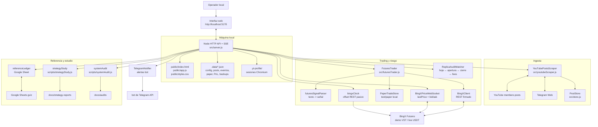
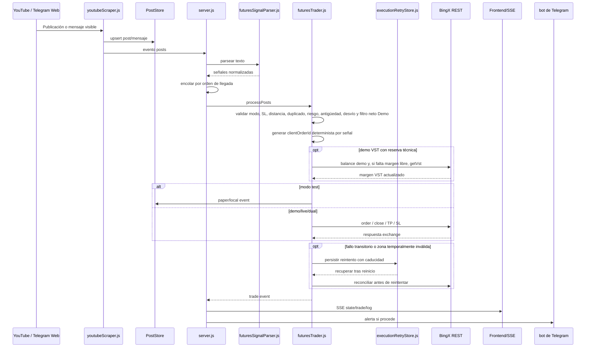
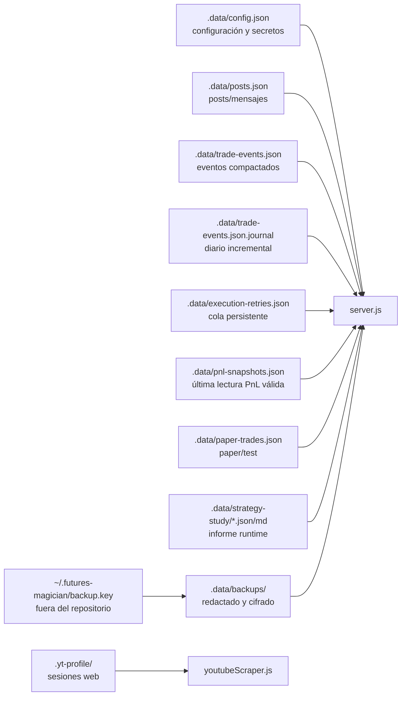

# Arquitectura

Futures Magician es un servidor Node.js local con frontend estático, scraping por Playwright, persistencia en JSON local y conexiones opcionales a Telegram y BingX.

## Vista de contenedores



## Secuencia de una señal



## Modelo de datos local



Regla de seguridad: `.data/` y `.yt-profile/` son entorno local y no forman parte del repositorio.

## Componentes

### `src/server.js`

Orquesta:

- API HTTP.
- Server-Sent Events para la UI.
- Arranque/parada del scraper.
- Estado, logs y salud.
- bot de Telegram de alertas.
- Telegram Web como fuente de mensajes.
- BingX.
- Cola serial de señales para evitar carreras entre YouTube y Telegram Web.
- Reintentos cortos de entradas cuyo stop o precio aún no estén en zona válida.
- Recuperación de reintentos pendientes después de reiniciar el proceso.
- Recuperación acotada de aperturas corregidas en publicaciones editadas, solo en Demo VST.
- Reconciliación de posiciones antes de reenviar una apertura.
- Cierre inmediato a mercado con auditoría de slippage.
- Reintentos idempotentes de cierres que fallen por red o error transitorio de BingX.
- Cohorte posterior a mejoras y cobertura de paquetes de señales.
- Filtro neto de entrada Demo con modo sombra por defecto y modo bloqueo opcional.
- Auditoría del filtro neto que enlaza cada apertura evaluada con el cierre de su posición, estima el resultado tras costes y detecta umbrales no discriminantes.
- Reserva técnica Demo VST activada solo con confirmación explícita y endpoint dedicado.
- Portfolio dinámico.
- PnL histórico.

### `src/executionReliability.js`

Genera una identidad estable para cada apertura a partir de modo, publicación, símbolo, dirección, entrada y stop. El `clientOrderId` enviado a BingX es determinista, por lo que un timeout ambiguo no puede generar una segunda orden distinta al reintentarse.

También clasifica qué errores son transitorios. No reintenta errores de credenciales, límites de riesgo ni configuraciones inválidas.

### `src/executionRetryStore.js`

Mantiene la cola local de aperturas y cierres pendientes mediante reemplazo atómico. La cola no contiene secretos y conserva modo, señal, caducidad, intentos y último motivo. Al arrancar, `server.js` la recupera y reconcilia BingX antes de cualquier reenvío.

### `src/atomicFile.js`

Centraliza el reemplazo atómico utilizado por los almacenes JSON y por el diario de eventos. En Windows reintenta únicamente bloqueos transitorios `EPERM`, `EBUSY` y `EACCES`, con espera exponencial acotada; un error permanente se propaga de inmediato y el temporal se limpia siempre.

### `src/coverageRecovery.js`

Selecciona huecos recientes de cobertura que pueden recuperarse de forma segura. Solo propone aperturas Demo con motivo `no_execution_event`, dentro de la ventana temporal y con una señal parseada exacta. Los fallos ya explicados, los huecos antiguos y cualquier modo Live quedan fuera.

### `src/editedSignalRecovery.js`

Compara las señales estructuradas antes y después de una edición. Solo devuelve aperturas ya presentes en la versión anterior cuya entrada, stop o apalancamiento hayan cambiado; una edición no puede añadir un ticker o una dirección nuevos. `server.js` aplica después la edad máxima, las validaciones operativas y el antiduplicados; la ruta está desactivada fuera de Demo VST.

### `src/promotionGate.js`

Calcula una puerta informativa basada en muestra, cobertura, paquetes completos, fallos de parser, reintentos, reconciliación, SL, órdenes huérfanas y resultado neto tras costes. Nunca cambia el modo ni arma live automáticamente.

### `src/httpSecurity.js`

Centraliza cabeceras de seguridad, validación de origen, limitación de mutaciones y autenticación básica opcional. El servidor escucha en `127.0.0.1` de forma predeterminada.

### `src/youtubeScraper.js`

Usa Playwright con perfil persistente:

```text
.yt-profile/
```

Responsabilidades:

- abrir YouTube;
- leer posts visibles;
- abrir Telegram Web;
- leer mensajes visibles de canal;
- leer Telegram Web en un bucle independiente con `pollSeconds`;
- refrescar Telegram Web cada `refreshSeconds`;
- emitir `posts`, `status`, `progress` y `log`.

Los mensajes de Telegram Web se guardan como posts con `source: "telegram_web"`.

### `src/store.js`

Guarda posts y mensajes filtrados en:

```text
.data/posts.json
```

Hace upsert por `post.id`, mantiene `firstSeenAt`, `lastSeenAt`, `seenCount` y `source`.

### `src/futuresSignalParser.js`

Convierte texto libre en señales normalizadas:

- aperturas `LONG` / `SHORT`;
- entradas LIMIT con precio;
- cierres por símbolo;
- cierre global;
- TP;
- modificacion de SL;
- SL a break even;
- multi-ticker y mensajes mixtos.

### `src/futuresTrader.js`

Gestiona ejecución:

- valida configuración y riesgo;
- en Demo VST, puede hacer un preflight único de margen por paquete y pedir solo la diferencia necesaria de reserva técnica;
- calcula `netEntryFilter` para comparar coste/riesgo, break-even de margen, R/R y TP neto; en modo sombra solo audita y en modo bloqueo corta aperturas Demo desfavorables;
- publica `netEntryFilterAudit` en el estado para que la UI muestre muestra, operaciones marcadas, resultado neto estimado, motivo dominante y advertencias de configuración;
- consulta contrato y ticker en BingX;
- calcula cantidad;
- envía órdenes `MARKET` o `LIMIT`;
- adjunta SL/TP a aperturas;
- cancela y recrea TP/SL de gestión;
- abre/cierra paper local;
- cierra posiciones demo/live;
- soporta modo `dual`.
- consulta posiciones e ingresos de la cuenta activa para aplicar límites de riesgo reales;
- impide perseguir entradas y rechaza stops anormalmente lejanos;
- ejecuta cierres explícitos inmediatamente y conserva, sin condicionar la orden, la cotización y los tiempos de la solicitud como telemetría.
- descuenta aportaciones técnicas VST de la equity estratégica y del ROI demo.

### `src/replicaAuditMatcher.js`

Reconstruye el ciclo operativo completo:

- empareja cada fila de la hoja con la apertura más probable del mismo activo;
- enlaza PnL, comisión de apertura, comisión de cierre y funding;
- tolera operaciones ausentes sin desplazar todas las posteriores;
- usa el histórico de órdenes como fuente primaria cuando cubre al menos el 80% de los eventos locales;
- recupera aperturas ejecutadas en BingX que no sobrevivieron en el diario local;
- enlaza `orderId`, `positionID`, cantidad ejecutada, `avgPrice` y `REALIZED_PNL` sin redondear identificadores;
- reparte uno o varios cierres de BingX entre las entradas de una posición agregada;
- vuelve al emparejamiento por eventos e ingresos si el histórico exacto no alcanza cobertura suficiente.

### `src/operationalAudit.js`

Calcula métricas de ejecución y escenarios económicos comparables: bruto teórico, neto con entrada y salida taker y neto con entrada maker y salida taker. La devolución de comisiones solo se incorpora al resultado observado cuando aparece acreditada en los ingresos de BingX.

### `src/bingxClient.js`

Cliente REST firmado con HMAC para BingX:

- balance;
- income/PnL;
- contracts;
- ticker;
- positions;
- órdenes abiertas;
- histórico de órdenes;
- margin type;
- leverage;
- place order;
- cancel order;
- close position;
- VST.

Los IDs largos de orden, posición, operación y órdenes relacionadas se parsean como string antes de llamar a `JSON.parse`, evitando el redondeo silencioso de JavaScript.

La misma clase expone la hora pública de BingX sin credenciales. `src/server.js` la consulta fuera del camino de ejecución, una vez al arrancar y después cada cinco minutos.

Entornos:

- `prod-live`: BingX real.
- `prod-vst`: BingX Demo VST.

### `src/bingxClock.js`

Calcula el desfase aparente entre el reloj local y el reloj REST de BingX mediante el punto medio de la petición. Expone offset, RTT, incertidumbre, antigüedad y nivel, y marca siempre la muestra como `observationalOnly`. Un error conserva la última lectura válida y una lectura de más de quince minutos queda caducada. Esta telemetría no cambia señales, guards, tamaños, reintentos, stops ni cierres.

### `src/bingxPriceWebSocket.js`

Conecta al WebSocket público de mercado de BingX. Mantiene `lastPrice` para valorar posiciones y procesar cierres paper, y `bookTicker` para observar el mejor bid/ask cada 200 ms. Ambos canales están separados: una actualización de bid/ask nunca se emite como precio de mercado ni puede disparar un cierre. Los activos que hayan aparecido en señales de apertura durante los últimos 30 días permanecen suscritos, hasta un máximo de 24, para disponer de una instantánea anterior al procesamiento de un paquete incluso después de un periodo sin posiciones abiertas.

Cuando se detecta un paquete de aperturas, todos sus símbolos quedan observados durante diez minutos. La suscripción se inicia antes de procesar la primera orden y no introduce ninguna espera. `FuturesTrader` lee la última instantánea fresca de forma síncrona justo antes de enviar la orden; si falta o está caducada, conserva ese hecho como ausencia de evidencia y continúa con la operativa original.

Las posiciones abiertas permanecen suscritas al mismo WebSocket. Justo antes de un cierre explícito, `FuturesTrader` toma la instantánea ya disponible y temporiza la llamada que cierra la posición, tanto si usa `closePosition` como una orden `MARKET reduceOnly`. No espera una actualización nueva, no añade una consulta REST y no cambia la decisión de cerrar.

Se usa para:

- marcar PnL flotante paper;
- disparar cierres paper por SL/TP.

### `src/paperTradeStore.js`

Guarda operaciones locales:

```text
.data/paper-trades.json
```

Calcula:

- PnL diario;
- PnL mensual;
- exposición abierta;
- cierres;
- cierre global;
- TP/SL paper;
- win rate.

### `src/referenceLedger.js`

Lee Google Sheets vía endpoint `gviz` y transforma la hoja mensual a posiciones de referencia.

La auditoría acota las fuentes a la ventana temporal antes de emparejar operaciones. Además, separa las aperturas VST posteriores a la última fila disponible de la hoja: se muestran como pendientes de referencia y no como operaciones extra ni como desalineaciones demostradas.

También resuelve enlaces acortados de portfolio. El frontend presenta las posiciones descargadas por `gviz` en una tabla nativa con scroll y conserva un enlace al documento original; no depende de que Google permita cargar una sesión dentro de un `iframe`.

### `src/portfolioDetector.js`

Detecta posts de portfolio con enlaces nuevos y actualiza la fuente activa.

## Persistencia

```text
.data/config.json        Config local y claves
.data/posts.json         Posts/mensajes scrapeados
.data/paper-trades.json  Operaciones paper
.data/trade-events.json  Eventos compactados
.data/trade-events.json.journal Eventos nuevos pendientes de compactación
.data/execution-retries.json Cola de reintentos recuperable
.data/pnl-snapshots.json Última lectura válida de PnL y fuentes BingX
.yt-profile/             Sesiones Chromium/YouTube/Telegram Web
```

Nada de eso debe subirse al repositorio.

## API principal

Estado:

```text
GET /api/state
GET /api/health
GET /api/events
GET /api/audit
GET /api/operational-status
GET /api/execution-packages
GET /api/promotion-gate
```

Posts:

```text
GET  /api/posts
POST /api/posts/clear
GET  /api/export.json
GET  /api/export.csv
```

Scraper:

```text
POST /api/browser/open
POST /api/browser/open-telegram
POST /api/scrape/start
POST /api/scrape/stop
```

Telegram:

```text
GET  /api/telegram
PUT  /api/telegram
POST /api/telegram/test
POST /api/telegram/detect-chat
GET  /api/telegram-source
PUT  /api/telegram-source
```

BingX:

```text
GET  /api/bingx
PUT  /api/bingx
GET  /api/bingx/open-positions
POST /api/bingx/test-connection
POST /api/bingx/vst
POST /api/bingx/probe
POST /api/bingx/replay-latest-signal
POST /api/bingx/paper/clear
GET  /api/bingx/pnl
GET  /api/bingx/pnl-sources
POST /api/bingx/parse-test
```

Portfolio/PnL:

```text
GET /api/portfolio
PUT /api/portfolio
GET /api/reference-ledger
GET /api/historical-pnl
GET /api/risk
GET /api/replica-audit
GET /api/price-feed
```

`GET /api/replica-audit` devuelve, además del detalle por operación, `summary.gapBridge`. Este bloque forma una identidad contable desde la réplica teórica hasta el neto BingX y conserva por separado las operaciones posteriores a la cobertura de la hoja. `summary.matchedGapAttribution` abre a su vez el tramo de operaciones emparejadas en contabilidad de referencia, diferencia de entrada, diferencia de salida, cantidad/fills y evidencia incompleta.

La respuesta incorpora asimismo `cohortComparison`. El servidor selecciona la cohorte archivada que terminó inmediatamente antes del inicio de la cohorte activa y delega el cálculo en `src/cohortComparison.js`. El módulo trabaja con dos niveles de evidencia:

- métricas observadas sobre todos los cierres de cada periodo, como incidencias técnicas, costes, PnL y cobertura del histórico firmado;
- métricas de alineación únicamente sobre las operaciones que todavía tienen una fila comparable en la hoja.

Los totales se normalizan por cierre o por operación emparejada. El contraste económico usa un bootstrap determinista de 4.000 remuestreos sobre el PnL neto enlazado de cada ciclo y publica media, intervalo exploratorio del 95% y proporción de remuestreos favorables. La cobertura inferior al 80% o menos de 30 operaciones comparables se etiqueta como parcial. Todo este flujo es de solo lectura y queda fuera del camino que procesa o ejecuta señales.

Cada resumen de cohorte incorpora `entryExecutionAnalysis`, calculado en `src/operationalAudit.js`. Las aperturas se deduplican por identidad de evento u orden y se separan en dos tramos: `señal → cotización previa` y `cotización previa → fill`. El resumen conserva muestra, desviación adversa, ruta inmediata o reintentada, latencia, activo, franja horaria de Madrid, posición dentro del paquete e impacto económico únicamente cuando existe una operación emparejada. La ausencia de evidencia económica se representa como `null`, nunca como un cero observado.

Los eventos nuevos incorporan `executionTelemetry` con dos lecturas temporizadas de `lastPrice`, la instantánea `bookTicker` más próxima al envío y el RTT local de la petición de orden. La fila auditada lo expone como `vst.entryTelemetry`. A partir de esa evidencia, la auditoría separa spread, `lastPrice → ask` para LONG o `lastPrice → bid` para SHORT, y `precio ejecutable → fill`. La marca temporal enviada por BingX se conserva junto a la hora de recepción local para medir por separado `BingX → recepción local` y `recepción local → envío`; el primer tramo se trata como diferencia de relojes observada, no como latencia de red pura. `packageObservation` añade la hora de inicio del paquete, su tamaño, la posición exacta de la señal y el bid/ask disponible en ese instante. Esto permite medir `inicio del paquete → preenvío` como un tramo independiente. La cobertura es prospectiva: no reconstruye bid/ask históricos ni convierte su ausencia en cero.

Cada orden de cierre explícito incorpora además `executionTelemetry` dentro de `exchangeClose.orders`; la fila auditada lo normaliza como `vst.closeTelemetry`. `closeExecutionAnalysis` deduplica posiciones agregadas y separa spread, `último precio → bid` al cerrar LONG o `último precio → ask` al cerrar SHORT, `precio ejecutable → fill`, antigüedad de cotización y RTT. Los cierres históricos anteriores al despliegue permanecen sin instrumentar y los stops se mantienen fuera de este análisis prospectivo.

La fila auditada diferencia `openingAttemptAt`, tomado del inicio del intento local, de `openingFillAt`, procedente de `historyOrder.time` en el histórico firmado de BingX. Con ambos valores se separan reacción, espera por reintento, inicio del intento a fill y latencia total. La marca temporal del exchange tiene precisión de un segundo; pequeñas diferencias negativas debidas al redondeo se acotan a cero y no se presentan como latencia negativa.

`src/cohortComparison.js` transforma ambos resúmenes en `cohortComparison.entryDiagnosis`. Solo compara un grupo cuando cada cohorte aporta al menos tres aperturas; mantiene separados el activo con mayor deterioro actual y el deterioro que sí puede contrastarse contra la cohorte anterior. Una descomposición simétrica reconcilia la variación media en efecto de composición y cambio dentro de los grupos, tanto por activo como por posición. Son lecturas alternativas y correlacionadas, no contribuciones que puedan sumarse. El resultado llega al frontend y al informe diario, pero no alimenta guards, reintentos, tamaños ni decisiones de mercado.

`summary.executionRouteAnalysis` clasifica cada operación emparejada según la evidencia que precede al fill de cierre: cierre explícito, stop sin una señal de cierre anterior, publicación histórica no procesada, error histórico del guard, reintento protegido u ausencia de señal local enlazada. Cada ruta conserva su PnL de referencia, bruto BingX, gap, impacto de entrada y salida, costes, latencia y contadores de evidencia. Las familias y rutas forman otra identidad con residual máximo de 0,01 VST. Esta clasificación es analítica: describe asociaciones observadas y no estima dinero contrafactualmente recuperable.

`summary.executionPriceChain` profundiza un nivel más: usa la referencia parseada, la cotización inmediatamente anterior al envío y el fill confirmado para reconstruir cada cambio de precio. En cierres por stop emplea el stop configurado como objetivo y la posición observada al reconciliar; si falta una traza intermedia, conserva ese impacto en una categoría explícita. `summary.executionLatency` enlaza los eventos con `firstSeenAt` y separa reacción inicial de espera por reintentos. Los tres puentes se representan como waterfalls de Plotly y son exclusivamente analíticos: no intervienen en el parser, los guards ni la ejecución de señales.

La misma respuesta incluye `source.orderHistory` y `summary.orderHistoryEvidence`. El primer bloque describe la lectura firmada de BingX; el segundo demuestra cuántos ciclos usan fills exactos, cuántas aperturas se recuperaron desde el exchange y si queda algún cierre sin apertura. El frontend identifica visualmente el histórico vigente, una copia obsoleta o el fallback. Esta ruta es de solo lectura y no participa en la creación, modificación ni cierre de órdenes.

## Eventos SSE

La UI escucha:

- `state`
- `posts`
- `log`
- `telegram`
- `telegramSource`
- `bingx`
- `portfolio`
- `trade`
- `price`
- `heartbeat`

Los eventos `state` se envían como snapshot completo de `currentState()`. La UI los usa para mantener sincronizados paneles derivados como `closeGuardRetryQueue`, PnL, monitor, Telegram Web y estado BingX aunque el origen del broadcast haya pasado un payload parcial.

El servidor envía `heartbeat` cada 15 segundos y declara `retry: 3000`, `Cache-Control: no-transform` y `X-Accel-Buffering: no` para que proxies y túneles no retengan el flujo. El frontend considera congelado un canal sin actividad durante 45 segundos, lo cierra y lo recrea con esperas de 1, 2, 4, 8 y 15 segundos. El indicador superior cambia a `Reconectando panel` durante el corte y vuelve al estado operativo al recibir el siguiente evento. Este supervisor solo mantiene actualizada la interfaz; el monitor y la ejecución residen en el backend y continúan de forma independiente.

Cada payload JSON se valida dentro de su propio manejador. Un evento truncado se descarta sin propagar una excepción, muestra un aviso de interfaz y no cierra el canal ni modifica el último estado válido. El siguiente payload correcto o heartbeat limpia el aviso. La prueba Chromium de recuperación inyecta un evento `state` malformado y exige que el panel vuelva a sincronizarse sin errores JavaScript.

Cada proceso genera además una identidad efímera `runtime.id`, visible en `/api/state`, `/api/health` y el estado inicial SSE. El navegador conserva la última identidad únicamente durante la sesión de esa pestaña. Si tras una reconexión recibe otra distinta, actualiza la identidad y recarga el documento una sola vez; así un despliegue no deja HTML o JavaScript antiguos conectados a un backend nuevo. La recarga no cambia configuraciones, monitor, parser ni estado de órdenes.

El arranque del frontend no usa una barrera `Promise.all`: conecta SSE primero y resuelve estado, Telegram, Telegram Web, estudio, guardia, BingX y publicaciones de forma independiente. Cada lectura inicial dispone de 8 segundos; al vencerlos, `AbortController` cancela la petición para que `Promise.allSettled` pueda terminar. Un fallo deja un aviso de carga parcial, pero no cancela las demás fuentes ni el canal en tiempo real. Solo las cargas fallidas entran en un reintento con backoff de 2, 5, 15 y 30 segundos; el aviso desaparece cuando se recuperan. `scripts/frontendBootstrapCheck.js` inyecta un `503` a `/api/telegram`, un payload SSE corrupto y una respuesta bloqueada de `/api/telegram-source` dentro de Chromium; los tres ciclos deben recuperarse en la puerta Docker.

## Ciclo de un item nuevo

1. Scraper extrae posts de YouTube y mensajes de Telegram Web.
2. Store inserta o actualiza.
3. Si hay URL de portfolio nueva, actualiza fuente.
4. bot de Telegram envía alerta si procede.
5. Parser busca señales.
6. Trader ejecuta según modo.
7. UI recibe eventos por SSE.
8. PnL se recalcula al actualizar.

Los cierres explícitos no se retienen por slippage ni por un beneficio estimado pequeño. `futuresTrader.js` envía el cierre a mercado y adjunta una advertencia auditable cuando el precio ejecutable ya difiere del publicado.

Para Telegram Web, el servidor filtra mensajes sin señales para reducir ruido.

## Validación

```bash
npm run lint
npm test
npm run audit:system
```

`npm test` cubre parser, guardas de entrada, cierres, riesgo, emparejamiento y persistencia. Ninguno de estos comandos envía órdenes reales a BingX.
