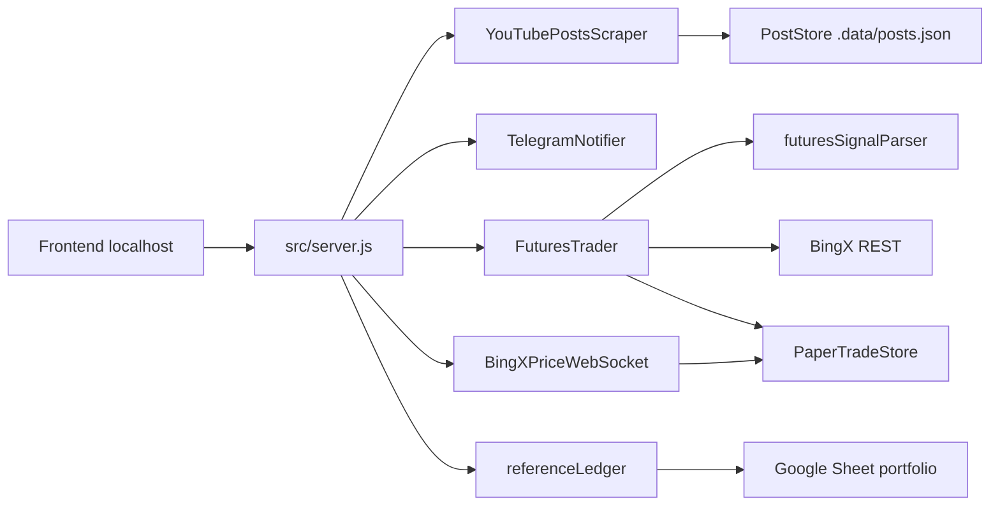

# Arquitectura

La aplicacion es un servidor Node.js local con frontend estatico, scraping por Playwright, persistencia en JSON local y conexiones opcionales a Telegram y BingX.

## Flujo principal



## Componentes

### `src/server.js`

Orquesta todo:

- API HTTP.
- Server-Sent Events para actualizar la UI.
- Arranque/parada del scraper.
- Logs, salud y estado.
- Telegram.
- BingX.
- Portfolio dinamico.
- PnL historico.

### `src/youtubeScraper.js`

Usa Playwright con perfil persistente:

```text
.yt-profile/
```

Extrae posts visibles de YouTube y emite eventos con:

- `posts`
- `status`
- `progress`
- `log`

### `src/store.js`

Guarda posts en:

```text
.data/posts.json
```

Hace upsert por `post.id`, mantiene `firstSeenAt`, `lastSeenAt` y `seenCount`.

### `src/futuresSignalParser.js`

Convierte texto libre en senales normalizadas:

- Aperturas `LONG` / `SHORT`.
- Cierres.
- Stop a break even.
- Multi-ticker.

### `src/futuresTrader.js`

Gestiona ejecucion:

- Valida configuracion y riesgo.
- Consulta contrato y ticker en BingX.
- Calcula cantidad.
- Envia ordenes.
- Abre/cierra paper local.
- Cierra posiciones demo/live.

### `src/bingxClient.js`

Cliente REST con firma HMAC para BingX:

- Balance.
- Income/PnL.
- Contracts.
- Ticker.
- Positions.
- Set margin type.
- Set leverage.
- Place order.
- Close position.
- VST.

Entornos:

- `prod-live`: BingX real.
- `prod-vst`: BingX Demo VST.

### `src/bingxPriceWebSocket.js`

Conecta a WebSocket de mercado de BingX y emite precios para simbolos con posiciones paper abiertas.

Se usa para:

- Marcar PnL flotante paper.
- Disparar cierres paper por SL/TP.

### `src/paperTradeStore.js`

Guarda operaciones locales en:

```text
.data/paper-trades.json
```

Calcula:

- PnL diario.
- PnL mensual.
- Exposicion abierta.
- Cierres.
- Win rate.

### `src/referenceLedger.js`

Lee Google Sheets via endpoint `gviz` y transforma la hoja mensual a posiciones de referencia.

Tambien resuelve enlaces acortados de portfolio que embeben Google Sheets en iframe.

### `src/portfolioDetector.js`

Detecta posts de portfolio con enlaces nuevos y actualiza la fuente activa.

## Persistencia

```text
.data/config.json        Config local y claves
.data/posts.json         Posts scrapeados
.data/paper-trades.json  Operaciones paper
.yt-profile/             Sesion Chromium/YouTube
```

Nada de eso debe subirse al repositorio.

## API principal

Estado:

```text
GET /api/state
GET /api/health
GET /api/events
```

Posts:

```text
GET  /api/posts
POST /api/posts/clear
GET  /api/export.json
GET  /api/export.csv
```

Scraper:

```text
POST /api/browser/open
POST /api/scrape/start
POST /api/scrape/stop
```

Telegram:

```text
GET  /api/telegram
PUT  /api/telegram
POST /api/telegram/test
POST /api/telegram/detect-chat
```

BingX:

```text
GET  /api/bingx
PUT  /api/bingx
POST /api/bingx/test-connection
POST /api/bingx/vst
POST /api/bingx/probe
POST /api/bingx/replay-latest-signal
POST /api/bingx/paper/clear
GET  /api/bingx/pnl
POST /api/bingx/parse-test
```

Portfolio/PnL:

```text
GET /api/portfolio
PUT /api/portfolio
GET /api/reference-ledger
GET /api/historical-pnl
GET /api/risk
GET /api/price-feed
GET /api/audit
```

## Eventos SSE

La UI escucha:

- `state`
- `posts`
- `log`
- `telegram`
- `bingx`
- `portfolio`
- `trade`
- `price`

## Ciclo de un post nuevo

1. Scraper extrae posts visibles.
2. Store inserta o actualiza.
3. Si hay URL de portfolio nueva, actualiza fuente.
4. Telegram envia alerta si procede.
5. Parser busca senales.
6. Trader ejecuta segun modo.
7. UI recibe eventos por SSE.
8. PnL se recalcula al actualizar.

## Validacion

La validacion actual es sintactica:

```bash
npm run lint
```

Este comando hace `node --check` sobre los archivos principales. No ejecuta pruebas end-to-end ni ordenes contra BingX.
