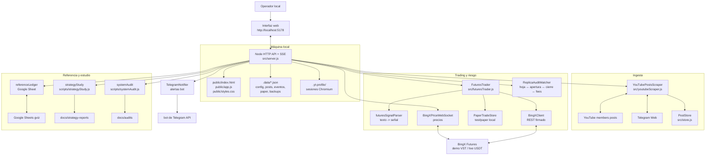
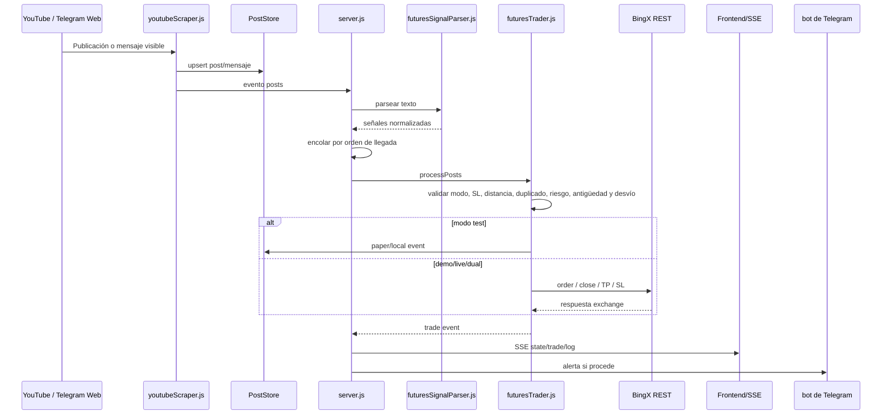
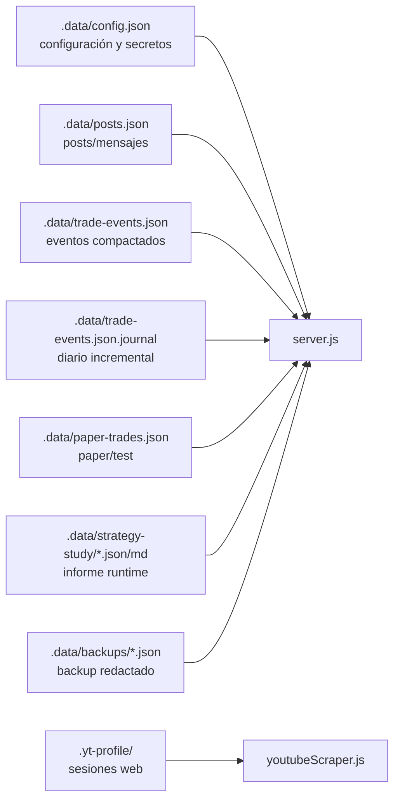

# Arquitectura

Futures Magician es un servidor Node.js local con frontend estático, scraping por Playwright, persistencia en JSON local y conexiones opcionales a Telegram y BingX.

## Vista de contenedores



## Secuencia de una señal



## Modelo de datos local



Regla de seguridad: `.data/` y `.yt-profile/` son entorno local y no forman parte del repositorio.

## Componentes

### `src/server.js`

Orquesta:

- API HTTP.
- Server-Sent Events para la UI.
- Arranque/parada del scraper.
- Estado, logs y salud.
- bot de Telegram de alertas.
- Telegram Web como fuente de mensajes.
- BingX.
- Cola serial de señales para evitar carreras entre YouTube y Telegram Web.
- Reintentos cortos de entradas cuyo stop o precio aún no estén en zona válida.
- Cierre inmediato a mercado con auditoría de slippage.
- Portfolio dinámico.
- PnL histórico.

### `src/youtubeScraper.js`

Usa Playwright con perfil persistente:

```text
.yt-profile/
```

Responsabilidades:

- abrir YouTube;
- leer posts visibles;
- abrir Telegram Web;
- leer mensajes visibles de canal;
- refrescar Telegram Web cada `refreshSeconds`;
- emitir `posts`, `status`, `progress` y `log`.

Los mensajes de Telegram Web se guardan como posts con `source: "telegram_web"`.

### `src/store.js`

Guarda posts y mensajes filtrados en:

```text
.data/posts.json
```

Hace upsert por `post.id`, mantiene `firstSeenAt`, `lastSeenAt`, `seenCount` y `source`.

### `src/futuresSignalParser.js`

Convierte texto libre en señales normalizadas:

- aperturas `LONG` / `SHORT`;
- entradas LIMIT con precio;
- cierres por símbolo;
- cierre global;
- TP;
- modificacion de SL;
- SL a break even;
- multi-ticker y mensajes mixtos.

### `src/futuresTrader.js`

Gestiona ejecución:

- valida configuración y riesgo;
- consulta contrato y ticker en BingX;
- calcula cantidad;
- envía órdenes `MARKET` o `LIMIT`;
- adjunta SL/TP a aperturas;
- cancela y recrea TP/SL de gestión;
- abre/cierra paper local;
- cierra posiciones demo/live;
- soporta modo `dual`.
- consulta posiciones e ingresos de la cuenta activa para aplicar límites de riesgo reales;
- impide perseguir entradas y rechaza stops anormalmente lejanos;
- ejecuta cierres explícitos inmediatamente y conserva la desviación como telemetría.

### `src/replicaAuditMatcher.js`

Reconstruye el ciclo operativo completo:

- empareja cada fila de la hoja con la apertura más probable del mismo activo;
- enlaza PnL, comisión de apertura, comisión de cierre y funding;
- tolera operaciones ausentes sin desplazar todas las posteriores;
- reparte un cierre de BingX entre varias entradas cuando el exchange las agregó en una posición.

### `src/bingxClient.js`

Cliente REST firmado con HMAC para BingX:

- balance;
- income/PnL;
- contracts;
- ticker;
- positions;
- órdenes abiertas;
- margin type;
- leverage;
- place order;
- cancel order;
- close position;
- VST.

Los IDs largos de orden se parsean como string para evitar redondeo de JavaScript.

Entornos:

- `prod-live`: BingX real.
- `prod-vst`: BingX Demo VST.

### `src/bingxPriceWebSocket.js`

Conecta al WebSocket de mercado de BingX y emite precios para símbolos con posiciones paper abiertas.

Se usa para:

- marcar PnL flotante paper;
- disparar cierres paper por SL/TP.

### `src/paperTradeStore.js`

Guarda operaciones locales:

```text
.data/paper-trades.json
```

Calcula:

- PnL diario;
- PnL mensual;
- exposición abierta;
- cierres;
- cierre global;
- TP/SL paper;
- win rate.

### `src/referenceLedger.js`

Lee Google Sheets vía endpoint `gviz` y transforma la hoja mensual a posiciones de referencia.

También resuelve enlaces acortados de portfolio que embeben Google Sheets en iframe.

### `src/portfolioDetector.js`

Detecta posts de portfolio con enlaces nuevos y actualiza la fuente activa.

## Persistencia

```text
.data/config.json        Config local y claves
.data/posts.json         Posts/mensajes scrapeados
.data/paper-trades.json  Operaciones paper
.data/trade-events.json  Eventos compactados
.data/trade-events.json.journal Eventos nuevos pendientes de compactación
.yt-profile/             Sesiones Chromium/YouTube/Telegram Web
```

Nada de eso debe subirse al repositorio.

## API principal

Estado:

```text
GET /api/state
GET /api/health
GET /api/events
GET /api/audit
```

Posts:

```text
GET  /api/posts
POST /api/posts/clear
GET  /api/export.json
GET  /api/export.csv
```

Scraper:

```text
POST /api/browser/open
POST /api/browser/open-telegram
POST /api/scrape/start
POST /api/scrape/stop
```

Telegram:

```text
GET  /api/telegram
PUT  /api/telegram
POST /api/telegram/test
POST /api/telegram/detect-chat
GET  /api/telegram-source
PUT  /api/telegram-source
```

BingX:

```text
GET  /api/bingx
PUT  /api/bingx
GET  /api/bingx/open-positions
POST /api/bingx/test-connection
POST /api/bingx/vst
POST /api/bingx/probe
POST /api/bingx/replay-latest-signal
POST /api/bingx/paper/clear
GET  /api/bingx/pnl
GET  /api/bingx/pnl-sources
POST /api/bingx/parse-test
```

Portfolio/PnL:

```text
GET /api/portfolio
PUT /api/portfolio
GET /api/reference-ledger
GET /api/historical-pnl
GET /api/risk
GET /api/replica-audit
GET /api/price-feed
```

## Eventos SSE

La UI escucha:

- `state`
- `posts`
- `log`
- `telegram`
- `telegramSource`
- `bingx`
- `portfolio`
- `trade`
- `price`

Los eventos `state` se envían como snapshot completo de `currentState()`. La UI los usa para mantener sincronizados paneles derivados como `closeGuardRetryQueue`, PnL, monitor, Telegram Web y estado BingX aunque el origen del broadcast haya pasado un payload parcial.

## Ciclo de un item nuevo

1. Scraper extrae posts de YouTube y mensajes de Telegram Web.
2. Store inserta o actualiza.
3. Si hay URL de portfolio nueva, actualiza fuente.
4. bot de Telegram envía alerta si procede.
5. Parser busca señales.
6. Trader ejecuta según modo.
7. UI recibe eventos por SSE.
8. PnL se recalcula al actualizar.

Los cierres explícitos no se retienen por slippage ni por un beneficio estimado pequeño. `futuresTrader.js` envía el cierre a mercado y adjunta una advertencia auditable cuando el precio ejecutable ya difiere del publicado.

Para Telegram Web, el servidor filtra mensajes sin señales para reducir ruido.

## Validación

```bash
npm run lint
npm test
npm run audit:system
```

`npm test` cubre parser, guardas de entrada, cierres, riesgo, emparejamiento y persistencia. Ninguno de estos comandos envía órdenes reales a BingX.
